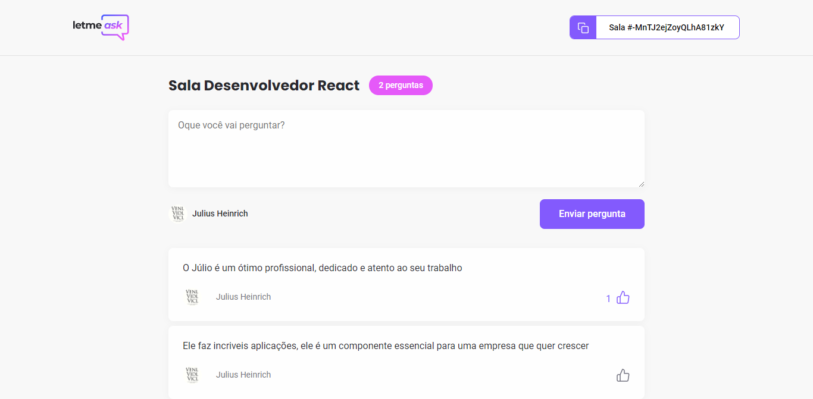
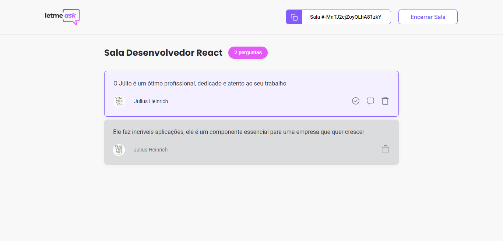

# Reponde ai - O seu aplicativo de lives

Aplicativo que permite as pessoas que estão assistindo lives enviar as suas perguntas, em tempo real, para o apresentador, ajuda muito hein kkk. Com Login usando Google OAtuh do firebase + bancdo de dados real time do Firebase e regras de negócio.

## Tabela de conteúdos

- [Visão Geral](#visao-geral)
  - [O desafio](#o-desafio)
  - [Screenshot](#screenshot)
  - [Links](#links)
- [Meu processo](#meu-processo)
  - [Tecnologias](#tecnologias)
  - [Oque eu aprendi](#oque-eu-aprendi)
  - [Desenvolvimento Continuo](#development-continuo)
  - [Recursos Úteis](#recursos-uteis)
- [Autor](#autor)
- [Reconhecimentos](#reconhecimentos)


## Visão Geral

### O desafio

O usuário que é DONO da sala deveria ser capaz de:
- Se conectar ao aplicativo usando a sua conta do Google, com Oauth do Firebase;
- Criar uma sala com o nome desejado;
- Ler as perguntas enviadas, mas não pode fazer perguntas;
- Destacar uma pergunta, para mostrar qual pergunta ele está respondendo;
- Marcar perguntas como lida;
- Apagar perguntas;
- Encerrar a sala;


O usuário que é VISITANTE da sala deveria ser capaz de:
- Entrar na sala através do código que o criador deu para ele;
- Enviar uma perguntas em tempo real;
- Ler outras perguntas, dele mesmo e de outros;
- Dar like nas perguntas.

### Screenshot






### Links

- Live Site URL: [Comente Agora Web]()

## Meu processo

### Tecnologias

- Web-vitals
- SASS
- [React](https://reactjs.org/) - JS lib
- [Firebase](https://firebase.google.com/) - Back-end as a service
- [Typescript](https://www.typescriptlang.org/) - TypeScript is JavaScript with syntax for types.

### Oque eu aprendi

Eu aprendi muito sobre o Firebase, e tive muitos problemas porque em uma recente atualização ele mudou muito e não tinha muito conteúdo atualizado, mas eu persisti e consegui superar esse problema.

O Firebase é um back-end as a service, ou seja, ele cuida de tudo quando o assunto é back-end. 
Ele cuida das regras de negócios, database, autenticação e muito mais.
Mas vale a pena dizer que as suas regras de negócio são meio estranhas.

Eu me surpreendi quando eu vi como foi fácil criar um login de autenticação usando o Google com o firebase:
```tsx
import { auth, firebase } from "../services/firebase"

async function signInWithGoogle() {
    const provider = new firebase.auth.GoogleAuthProvider() 
    // Criando o login

    const result = await auth.signInWithPopup(provider) 
    // Escolhendo como fazer o login, neste caso com um popup
    if (result.user) {
        const { displayName, photoURL, uid } = result.user

        if (!displayName || !photoURL) { 
            // Condicional para negar o login a usuários que não tenham foto ou nome
            throw new Error('Missing either Name or photo from Google Account')
        }

        setUser({ 
            // Definindo quais são as info do usuário
            id: uid,
            name: displayName,
            avatar: photoURL
        })
    }
}
```
E simpes assim temos um login com o Google :D


Agora esse é o código que eu usei para criar uma nova sala, usando o `FormEvent` para definir a 'tipagem' do typescript.
Depois dou um retorno se o nome da sala for vazio.
Seguindo o código, acesso o banco de dados e vou criar a sala, com o titulo e o id do usuário que criou a sala.
Feito isso só dou um `history.push()` e coloco a chave da sala.
Segue o código:
```tsx
import { useHistory } from 'react-router-dom'
const history = useHistory()
const [ newRoom, setNewRoom ] = useState('')

async function handleCreateRoom(event: FormEvent) {
    event.preventDefault()

    if (newRoom.trim() === '') {
        return
    }

    const roomRef = database.ref('rooms')
    const firebaseRoom = await roomRef.push({
        title: newRoom,
        authorId: user?.id
    })

    history.push(`/rooms/${firebaseRoom.key}`)
}
```

### Desenvolvimento Continuo

Nossa esse projeto me cansou, realmente foi bem grande. **Daqui em diante vou continuar seguindo e aprendendo sobre o react**, foi bem interessante criar o hook `useRoom` porque ele ajudou muito na parte de não repetir código e ficar mais organizado.
Então vou focar em React.js :D

## Author

- Linkedin - [Julio Henrique](https://www.linkedin.com/in/julio-h/)
- Email - juliohjesus@gmail.com
